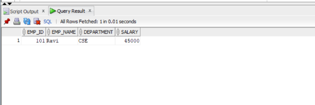
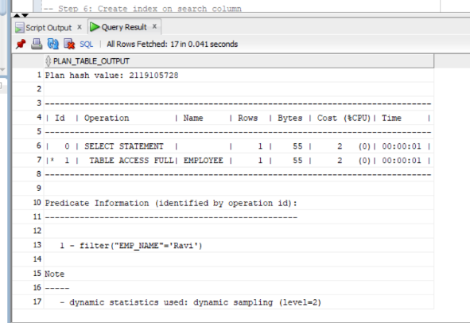
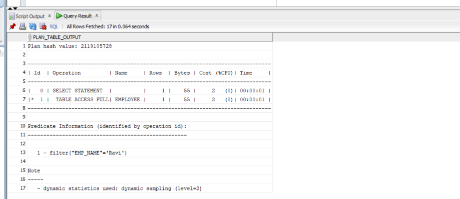
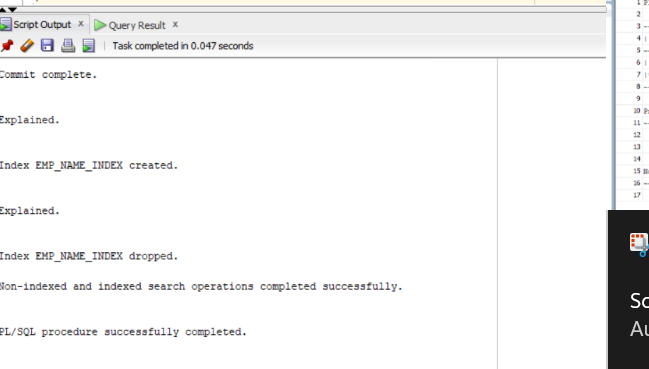

```
SET SERVEROUTPUT ON;

-- Step 1 & 2: Create EMPLOYEE table
CREATE TABLE EMPLOYEE
(
    EMP_ID NUMBER PRIMARY KEY,
    EMP_NAME VARCHAR2(30),
    DEPARTMENT VARCHAR2(20),
    SALARY NUMBER
);

-- Step 3: Insert sample records
INSERT INTO EMPLOYEE VALUES (101, 'Ravi', 'CSE', 45000);
INSERT INTO EMPLOYEE VALUES (102, 'Sita', 'ECE', 50000);
INSERT INTO EMPLOYEE VALUES (103, 'Kiran', 'CSE', 55000);
INSERT INTO EMPLOYEE VALUES (104, 'Anu', 'IT', 60000);
INSERT INTO EMPLOYEE VALUES (105, 'Rahul', 'CSE', 48000);

COMMIT;

-- Step 4: Search without index
SELECT *
FROM EMPLOYEE
WHERE EMP_NAME = 'Ravi';
```

```
-- Step 5: Display execution plan before indexing
EXPLAIN PLAN FOR
SELECT *
FROM EMPLOYEE
WHERE EMP_NAME = 'Ravi';

SELECT *
FROM TABLE(DBMS_XPLAN.DISPLAY);
```

```
-- Step 6: Create index on search column
CREATE INDEX EMP_NAME_INDEX
ON EMPLOYEE(EMP_NAME);

-- Step 7: Search using index
SELECT *
FROM EMPLOYEE
WHERE EMP_NAME = 'Ravi';

-- Step 8: Display execution plan after indexing
EXPLAIN PLAN FOR
SELECT *
FROM EMPLOYEE
WHERE EMP_NAME = 'Ravi';

SELECT *
FROM TABLE(DBMS_XPLAN.DISPLAY);
```

```
-- Step 9 & 10: Display index information
SELECT INDEX_NAME,
       TABLE_NAME,
       COLUMN_NAME
FROM USER_IND_COLUMNS
WHERE TABLE_NAME = 'EMPLOYEE';

-- Step 11: Drop the index
DROP INDEX EMP_NAME_INDEX;

-- Step 12: Stop the program
BEGIN
    DBMS_OUTPUT.PUT_LINE('Non-indexed and indexed search operations completed successfully.');
END;
/
```

