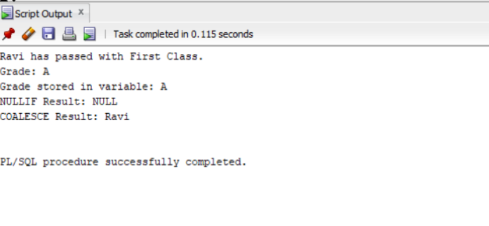
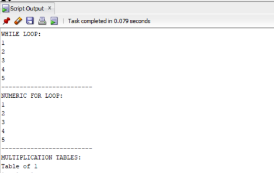
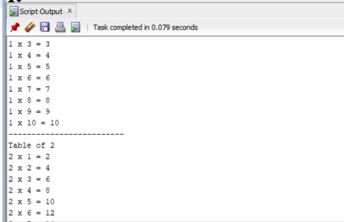
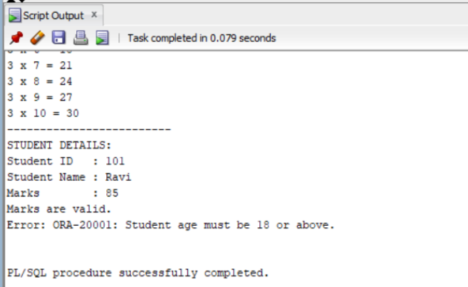

6A.EXPERIMENT
```
SET SERVEROUTPUT ON;

DECLARE
   
    v_student_name  VARCHAR2(50);
    v_marks         NUMBER;
    v_grade         VARCHAR2(10);
    v_test1         NUMBER;
    v_test2         NUMBER;
    v_nullif_result NUMBER;
    v_coalesce_result VARCHAR2(50);

BEGIN
    
    v_student_name := 'Ravi';
    v_marks := 85;
    v_test1 := 100;
    v_test2 := 100;

   
    IF v_marks >= 40 THEN
        IF v_marks >= 60 THEN
            DBMS_OUTPUT.PUT_LINE(
                v_student_name || ' has passed with First Class.'
            );
        ELSE
            DBMS_OUTPUT.PUT_LINE(
                v_student_name || ' has passed with Second Class.'
            );
        END IF;
    ELSE
        DBMS_OUTPUT.PUT_LINE(
            v_student_name || ' has failed.'
        );
    END IF;
 
    CASE
        WHEN v_marks >= 90 THEN
            DBMS_OUTPUT.PUT_LINE('Grade: A+');
        WHEN v_marks >= 80 THEN
            DBMS_OUTPUT.PUT_LINE('Grade: A');
        WHEN v_marks >= 70 THEN
            DBMS_OUTPUT.PUT_LINE('Grade: B');
        WHEN v_marks >= 60 THEN
            DBMS_OUTPUT.PUT_LINE('Grade: C');
        WHEN v_marks >= 50 THEN
            DBMS_OUTPUT.PUT_LINE('Grade: D');
        WHEN v_marks >= 40 THEN
            DBMS_OUTPUT.PUT_LINE('Grade: E');
        ELSE
            DBMS_OUTPUT.PUT_LINE('Grade: F');
    END CASE;


    v_grade :=
        CASE
            WHEN v_marks >= 90 THEN 'A+'
            WHEN v_marks >= 80 THEN 'A'
            WHEN v_marks >= 70 THEN 'B'
            WHEN v_marks >= 60 THEN 'C'
            WHEN v_marks >= 50 THEN 'D'
            WHEN v_marks >= 40 THEN 'E'
            ELSE 'F'
        END;

    
    DBMS_OUTPUT.PUT_LINE(
        'Grade stored in variable: ' || v_grade
    );

   
    v_nullif_result := NULLIF(v_test1, v_test2);

    IF v_nullif_result IS NULL THEN
        DBMS_OUTPUT.PUT_LINE(
            'NULLIF Result: NULL'
        );
    ELSE
        DBMS_OUTPUT.PUT_LINE(
            'NULLIF Result: ' || v_nullif_result
        );
    END IF;

   
    v_coalesce_result :=
        COALESCE(NULL, NULL, v_student_name, 'No Name');

    -- Display COALESCE result
    DBMS_OUTPUT.PUT_LINE(
        'COALESCE Result: ' || v_coalesce_result
    );

EXCEPTION
    WHEN OTHERS THEN
        DBMS_OUTPUT.PUT_LINE(
            'Error: ' || SQLERRM
        );
END;
/
```


6B.EXPERIMENT
```
SET SERVEROUTPUT ON;

DECLARE
    -- Declare required variables
    v_student_id    student.student_id%TYPE;
    v_student_name  student.student_name%TYPE;
    v_marks         student.marks%TYPE;
    v_age           NUMBER;

    -- User-defined exception
    e_invalid_marks EXCEPTION;

BEGIN
    -- 1. WHILE LOOP: Display numbers from 1 to 5
    DBMS_OUTPUT.PUT_LINE('WHILE LOOP:');

    v_student_id := 1;

    WHILE v_student_id <= 5
    LOOP
        DBMS_OUTPUT.PUT_LINE(v_student_id);
        v_student_id := v_student_id + 1;
    END LOOP;
     

    -- 2. NUMERIC FOR LOOP: Display numbers from 1 to 5
    DBMS_OUTPUT.PUT_LINE('-------------------------');
    DBMS_OUTPUT.PUT_LINE('NUMERIC FOR LOOP:');

    FOR i IN 1..5
    LOOP
        DBMS_OUTPUT.PUT_LINE(i);
    END LOOP;


    -- 3. NESTED FOR LOOP: Multiplication tables from 1 to 3
    DBMS_OUTPUT.PUT_LINE('-------------------------');
    DBMS_OUTPUT.PUT_LINE('MULTIPLICATION TABLES:');

    FOR i IN 1..3
    LOOP
        DBMS_OUTPUT.PUT_LINE('Table of ' || i);

        FOR j IN 1..10
        LOOP
            DBMS_OUTPUT.PUT_LINE(
                i || ' x ' || j || ' = ' || (i * j)
            );
        END LOOP;

        DBMS_OUTPUT.PUT_LINE('-------------------------');
    END LOOP;


    -- 4. Retrieve student record using SELECT INTO
    SELECT student_id, student_name, marks
    INTO v_student_id, v_student_name, v_marks
    FROM student
    WHERE student_id = 101;

    -- Display retrieved student details
    DBMS_OUTPUT.PUT_LINE('STUDENT DETAILS:');
    DBMS_OUTPUT.PUT_LINE(
        'Student ID   : ' || v_student_id
    );
    DBMS_OUTPUT.PUT_LINE(
        'Student Name : ' || v_student_name
    );
    DBMS_OUTPUT.PUT_LINE(
        'Marks        : ' || v_marks
    );


    -- 5. Validate student's marks
    IF v_marks > 100 THEN
        RAISE e_invalid_marks;
    ELSE
        DBMS_OUTPUT.PUT_LINE(
            'Marks are valid.'
        );
    END IF;


    -- 6. Validate student's age
    v_age := 17;

    IF v_age < 18 THEN
        RAISE_APPLICATION_ERROR(
            -20001,
            'Student age must be 18 or above.'
        );
    ELSE
        DBMS_OUTPUT.PUT_LINE(
            'Student age is valid.'
    END IF;


EXCEPTION

    -- Handle NO_DATA_FOUND exception

    WHEN NO_DATA_FOUND THEN

        DBMS_OUTPUT.PUT_LINE(
            'Error: No student record found.'

        );

    -- Handle user-defined exception
    WHEN e_invalid_marks THEN
        DBMS_OUTPUT.PUT_LINE(

            'Error: Student marks cannot be greater than 100.'
        );


    -- Handle other exceptions
    WHEN OTHERS THEN

        DBMS_OUTPUT.PUT_LINE(
            'Error: ' || SQLERRM

        );


END;
```




