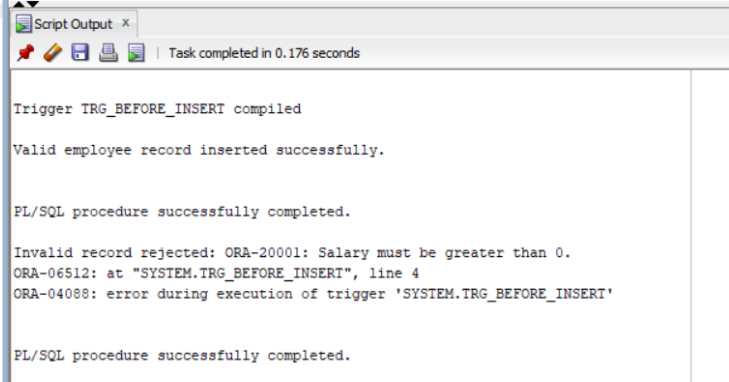
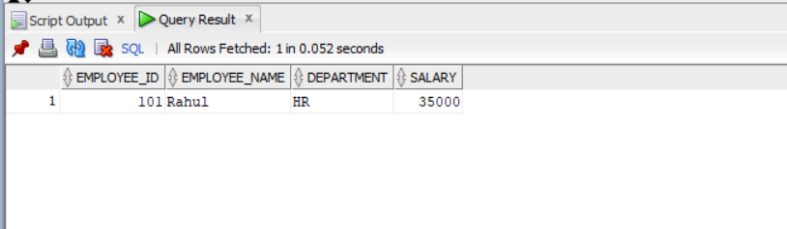
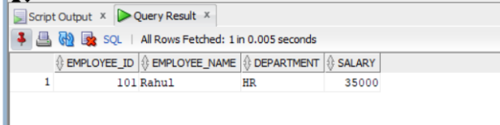
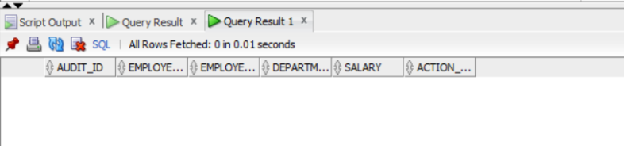
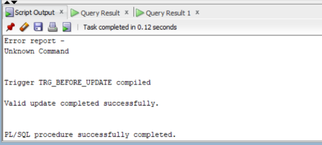
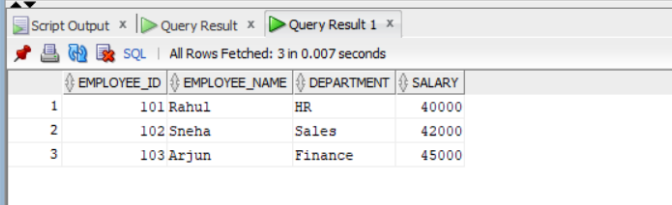
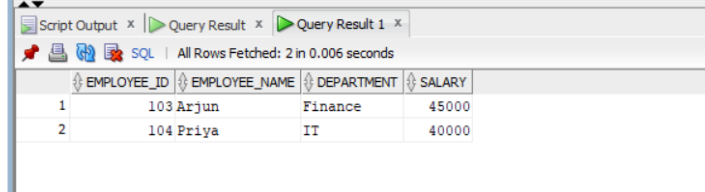
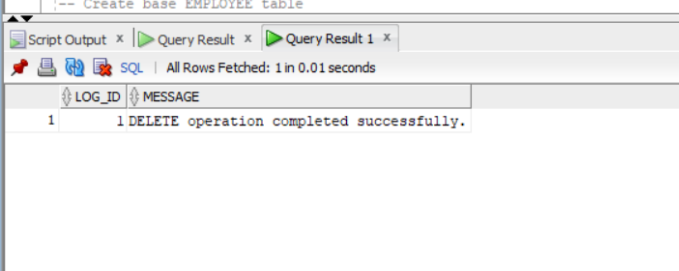
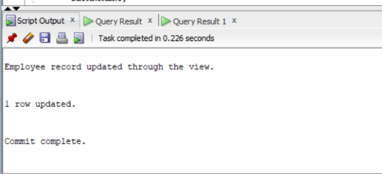
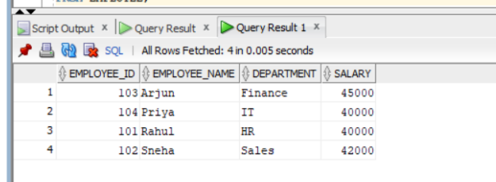

```
SET SERVEROUTPUT ON;

-- Step 1: Create EMPLOYEE table
CREATE TABLE EMPLOYEE
(
    EMPLOYEE_ID NUMBER(4) PRIMARY KEY,
    EMPLOYEE_NAME VARCHAR2(30),
    DEPARTMENT VARCHAR2(20),
    SALARY NUMBER(10,2)
);

-- Step 2: Create BEFORE INSERT trigger
CREATE OR REPLACE TRIGGER TRG_BEFORE_INSERT
BEFORE INSERT
ON EMPLOYEE
FOR EACH ROW
BEGIN
    -- Validate employee salary
    IF :NEW.SALARY <= 0 THEN
        RAISE_APPLICATION_ERROR(
            -20001,
            'Salary must be greater than 0.'
        );
    END IF;

    -- Validate employee name
    IF :NEW.EMPLOYEE_NAME IS NULL THEN
        RAISE_APPLICATION_ERROR(
            -20002,
            'Employee name cannot be NULL.'
        );
    END IF;
END;
/

-- Step 3: Insert valid record
BEGIN
    INSERT INTO EMPLOYEE
    VALUES (101, 'Rahul', 'HR', 35000);

    COMMIT;

    DBMS_OUTPUT.PUT_LINE(
        'Valid employee record inserted successfully.'
    );
END;
/

-- Step 4: Insert invalid record
BEGIN
    INSERT INTO EMPLOYEE
    VALUES (102, 'Sneha', 'Sales', -5000);

    COMMIT;

EXCEPTION
    WHEN OTHERS THEN
        DBMS_OUTPUT.PUT_LINE(
            'Invalid record rejected: ' || SQLERRM
        );
END;
/
```

```
-- Step 5: Display table contents
SELECT EMPLOYEE_ID,
       EMPLOYEE_NAME,
       DEPARTMENT,
       SALARY
FROM EMPLOYEE;
```

```
SET SERVEROUTPUT ON;

-- Create main EMPLOYEE table
CREATE TABLE EMPLOYEE
(
    EMPLOYEE_ID NUMBER(4) PRIMARY KEY,
    EMPLOYEE_NAME VARCHAR2(30),
    DEPARTMENT VARCHAR2(20),
    SALARY NUMBER(10,2)
);

-- Create AUDIT table
CREATE TABLE EMPLOYEE_AUDIT
(
    AUDIT_ID NUMBER(4),
    EMPLOYEE_ID NUMBER(4),
    EMPLOYEE_NAME VARCHAR2(30),
    DEPARTMENT VARCHAR2(20),
    SALARY NUMBER(10,2),
    ACTION_TYPE VARCHAR2(20)
);

-- Create AFTER INSERT trigger
CREATE OR REPLACE TRIGGER TRG_AFTER_INSERT
AFTER INSERT
ON EMPLOYEE
FOR EACH ROW
BEGIN
    INSERT INTO EMPLOYEE_AUDIT
    VALUES
    (
        :NEW.EMPLOYEE_ID,
        :NEW.EMPLOYEE_ID,
        :NEW.EMPLOYEE_NAME,
        :NEW.DEPARTMENT,
        :NEW.SALARY,
        'INSERT'
    );

    DBMS_OUTPUT.PUT_LINE(
        'Employee record inserted and audit record created.'
    );
END;
/

-- Insert a new employee record
INSERT INTO EMPLOYEE
VALUES (101, 'Rahul', 'HR', 35000);

COMMIT;

-- Display main table
SELECT * FROM EMPLOYEE;
```

```
-- Display audit table
SELECT * FROM EMPLOYEE_AUDIT;
```

```
SET SERVEROUTPUT ON;

-- Create EMPLOYEE table
CREATE TABLE EMPLOYEE
(
    EMPLOYEE_ID NUMBER(4) PRIMARY KEY,
    EMPLOYEE_NAME VARCHAR2(30),
    DEPARTMENT VARCHAR2(20),
    SALARY NUMBER(10,2)
);

-- Insert sample records
INSERT INTO EMPLOYEE VALUES (101, 'Rahul', 'HR', 35000);
INSERT INTO EMPLOYEE VALUES (102, 'Sneha', 'Sales', 42000);
FOR EACH ROW
    -- Check if new salary is negative
        RAISE_APPLICATION_ERROR(
            -20001,
    END IF;
    -- Check if salary is decreased
    IF :NEW.SALARY < :OLD.SALARY THEN
        );
    END IF;
END;
BEGIN
    UPDATE EMPLOYEE
    WHERE EMPLOYEE_ID = 101;


    DBMS_OUTPUT.PUT_LINE(
        'Valid update completed successfully.'
    );
END;
/

-- Invalid update
BEGIN
    UPDATE EMPLOYEE
    SET SALARY = 30000
    WHERE EMPLOYEE_ID = 102;

    COMMIT;

EXCEPTION
    WHEN OTHERS THEN
        DBMS_OUTPUT.PUT_LINE(
            'Invalid update rejected: ' || SQLERRM
        );
END;
/
```

```
-- Display final table
SELECT EMPLOYEE_ID,
       EMPLOYEE_NAME,
       DEPARTMENT,
       SALARY
FROM EMPLOYEE;
```

```
SET SERVEROUTPUT ON;


-- Create EMPLOYEE table
CREATE TABLE EMPLOYEE
(
    EMPLOYEE_ID NUMBER(4) PRIMARY KEY,
    EMPLOYEE_NAME VARCHAR2(30),
    DEPARTMENT VARCHAR2(20),
    SALARY NUMBER(10,2)
);

-- Create DELETE LOG table
CREATE TABLE DELETE_LOG
(
    LOG_ID NUMBER(4),
    MESSAGE VARCHAR2(100)
);

-- Insert sample employee records
INSERT INTO EMPLOYEE VALUES (101, 'Rahul', 'HR', 35000);
INSERT INTO EMPLOYEE VALUES (102, 'Sneha', 'Sales', 42000);
INSERT INTO EMPLOYEE VALUES (103, 'Arjun', 'Finance', 45000);
INSERT INTO EMPLOYEE VALUES (104, 'Priya', 'IT', 40000);

COMMIT;

-- Create AFTER DELETE Statement-Level Trigger
CREATE OR REPLACE TRIGGER TRG_AFTER_DELETE
AFTER DELETE
ON EMPLOYEE
BEGIN
    INSERT INTO DELETE_LOG
    VALUES (1, 'DELETE operation completed successfully.');

    DBMS_OUTPUT.PUT_LINE(
        'DELETE operation completed successfully.'
    );
END;
/

-- Delete multiple employee records
DELETE FROM EMPLOYEE
WHERE EMPLOYEE_ID IN (101, 102);

COMMIT;

-- Display remaining EMPLOYEE records
SELECT *
FROM EMPLOYEE;
```

```
-- Display DELETE LOG
SELECT *
FROM DELETE_LOG;
```

```
SET SERVEROUTPUT ON;

-- Create base EMPLOYEE table
CREATE TABLE EMPLOYEE
(
    EMPLOYEE_ID NUMBER(4) PRIMARY KEY,
    EMPLOYEE_NAME VARCHAR2(30),
    DEPARTMENT VARCHAR2(20),
    SALARY NUMBER(10,2)
);

-- Insert sample records
INSERT INTO EMPLOYEE VALUES (101, 'Rahul', 'HR', 35000);
INSERT INTO EMPLOYEE VALUES (102, 'Sneha', 'Sales', 42000);
INSERT INTO EMPLOYEE VALUES (103, 'Arjun', 'Finance', 45000);

COMMIT;

-- Create view
CREATE OR REPLACE VIEW EMPLOYEE_VIEW AS
SELECT EMPLOYEE_ID,
       EMPLOYEE_NAME,
       DEPARTMENT,
       SALARY
FROM EMPLOYEE;

-- Create INSTEAD OF UPDATE trigger
CREATE OR REPLACE TRIGGER TRG_UPDATE_VIEW
INSTEAD OF UPDATE
ON EMPLOYEE_VIEW
FOR EACH ROW
END;
/

-- Update employee through the view
UPDATE EMPLOYEE_VIEW
SET SALARY = 40000
WHERE EMPLOYEE_ID = 101;

COMMIT;
```

```
-- Display base table
SELECT EMPLOYEE_ID,
       EMPLOYEE_NAME,
       DEPARTMENT,
       SALARY
FROM EMPLOYEE;
```

```
BEGIN
        'Employee record updated through the view.'
    );
    UPDATE EMPLOYEE

    DBMS_OUTPUT.PUT_LINE(
        DEPARTMENT = :NEW.DEPARTMENT,
        SALARY = :NEW.SALARY
    WHERE EMPLOYEE_ID = :OLD.EMPLOYEE_ID;


